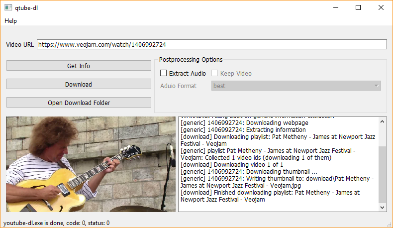
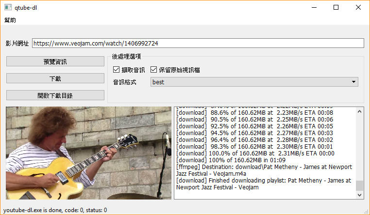

# qtube-dl
A simple GUI frontend for youtube-dl.

## Screenshot

## Prerequisites to build from source
- Qt5 and build tools
- CMake or Qt Creator

After building qtube-dl, you need to manually download [youtube-dl](https://github.com/rg3/youtube-dl/releases/latest) and [ffmpeg](https://ffmpeg.zeranoe.com/builds/).
